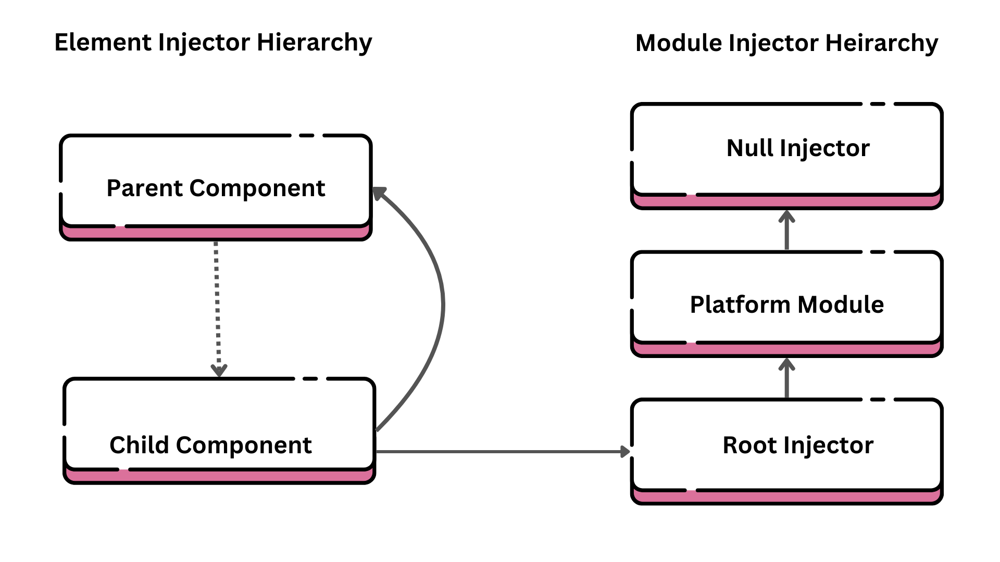

Dependency Injection is not a concept only used in Angular but also used in Kotlin and a few other languages and frameworks. It is a way to reduce tight coupling between services and duplication of code in your angular app. For example, you can define a user service and use this everywhere to fetch the current user details etc. You might have seen `contructor(private userService: UserService) {}` everywhere but what it actually means. Let's understand this step-by-step.

### Components don't create instances, they delegate to `Injector` object

Angular components do not directly create instances of services or dependencies they need. Instead, they rely on an Angular mechanism called the `Injector`. In Angular, services are singleton in scope of injector, meaning if some component requests a service instance we have to return the existing one instead of creating a new service instance. In Angular, services are provided in Injectors when we use providers in `@NgModule()` or `providedIn` property with Injectable annotation.

### How does it work internally?

Let's first create an Injector class

```ts
class Injector {
	// Using map as we need object as a key instead of string
	private injector = new Map();

	// We will provide array of service classes while initialising injector
	constructor(private providers: any[] = []) {
		this.providers.forEach((service) => {
			this.injector.set(service, new service());
		});
	}

	get(service: any) {
		const serviceInstance = this.injector.get(service);
		if (!serviceInstance) {
			throw Error('No provider');
		}
		return serviceInstance;
	}
}
```

Now, we have created injector class, we will see how components resolve the dependencies.

```js
// When angular compiles, it creates a injector object in component

// services can be provided in providers array or providedIn: root - tree-shakable way
const injector = new Injector([UserService]);
const component = new AppComponent(injector.get(UserService));
component.user.getUser();
```

You can see that for each service class, there is one and only one instance created everywhere in Angular. Now, let us understand the hierarchy of injectors in Angular.



Here is the complete hierarchy of how angular resolves them. First it searches in the same component - `Child`, if not found then goes to `Parent` component. Then, it searches in the `root` injector. Services which are configured as `providedIn: root` using `injectable()` notation. The `platformBrowserDynamic()` method creates an injector configured by a `PlatformModule`, which contains platform-specific dependencies. Finally, it reaches `NullInjector` where error is thrown.
