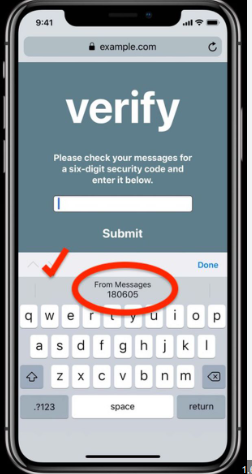

In this blog, we'll explore how to implement OTP autofill in an Ionic application using the autocomplete="one-time-code" attribute. This feature enhances user experience by allowing automatic OTP (One-Time Password) entry, especially on iOS devices.

### Create an Ionic Project

If you don't already have an Ionic project, you can create one using the following commands:

```bash
npm install -g @ionic/cli
ionic start otp-autofill blank
cd otp-autofill
```

### Setup the HTML form

Navigate to the `src/app/home/home.page.html` file. Here, we'll create a simple form to accept the OTP.

```html
<ion-header>
	<ion-toolbar>
		<ion-title> OTP Autofill Example </ion-title>
	</ion-toolbar>
</ion-header>

<ion-content>
	<form>
		<ion-item>
			<ion-label position="floating">Enter OTP</ion-label>
			<ion-input
				type="text"
				autocomplete="one-time-code"
				maxlength="6"
			></ion-input>
		</ion-item>
	</form>
</ion-content>
```

### Understand the `autocomplete="one-time-code"` Attribute

The autocomplete attribute with the value `one-time-code` signals to the browser that this field is expecting a one-time code, typically used for authentication. When an OTP is received via SMS, iOS will automatically suggest the code for the user to input.

### Test on ios device

To test the OTP autofill feature on an iOS device:

- Build your Ionic app for iOS.

- Run the app on an iOS device or simulator.

- Send an OTP to the device.

When the SMS with the OTP arrives, iOS should display the OTP above the keyboard, allowing the user to tap and autofill the input field something like this -



You can use the same in your ionic project to get auto-complete functionality for OTP verification. This will give a better UX for your end users.
